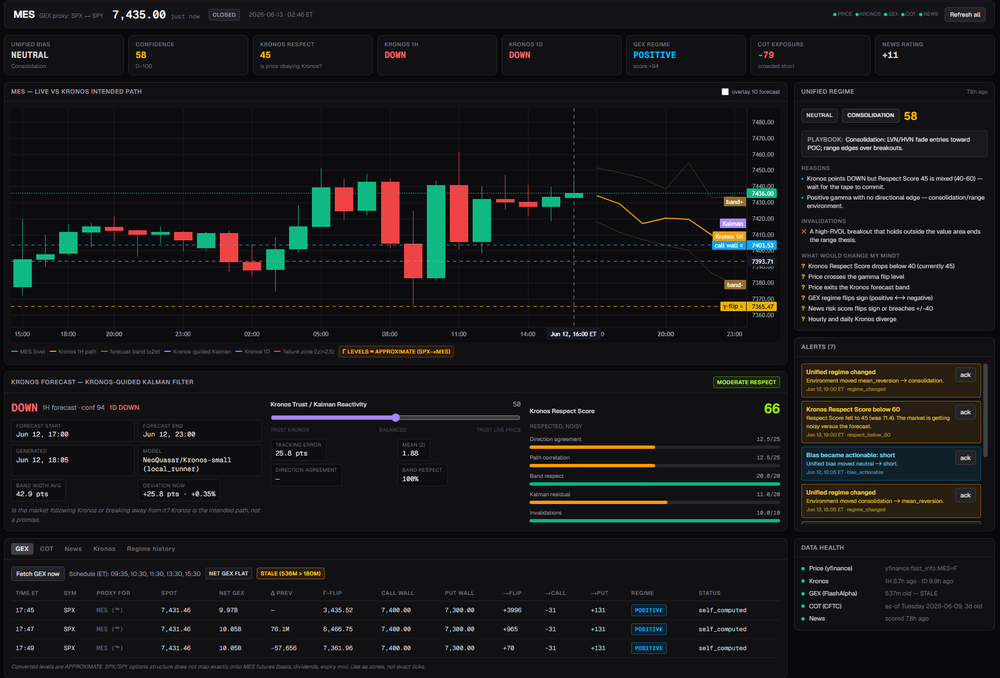

# Trader Terminal

A market decision-support dashboard for MES (Micro E-mini S&P 500). It treats an AI model's forecast
as a **pure price-action path** and measures how far the real market deviates from that path once
external forces — dealer positioning, institutional flow, and news — are taken into account. Built
with Claude Code.

> A personal research project. It is **decision support, not a trading bot** — there is no broker
> connection and no order execution.

---

## Screenshot



> The live terminal: the candlestick chart with the Kronos forecast path, the score row, the regime
> read, and live alerts.

---

## Core idea

**Kronos** is an open-source foundation model for financial markets. It is pre-trained on roughly
**12 billion candlesticks drawn from 45 exchanges**: it tokenizes raw OHLCV (open/high/low/close/
volume) data and forecasts future candles autoregressively, the same way a language model predicts
text. Because its only inputs are price and volume, the model has no awareness of options
positioning, order flow, macroeconomic releases, or headlines.

That limitation is exactly what makes it useful here. A Kronos forecast represents **price action in
a vacuum** — what price would tend to do based solely on its own historical dynamics, with none of
the external forces that actually move markets. I treat this as the *intended path* of price.

The hypothesis the terminal tests:

> **A forecast is fragile on its own — gamma, positioning, and news constantly pull price off any
> predicted path. The signal is in the deviation: knowing where, and by how much, the real market
> departs from the pure price-action path localizes the external force responsible and is more
> useful than the forecast alone.**

---

## Why the Kalman filter

A raw Kronos forecast is discrete and noisy — a fresh path on each run. To use "price action in a
vacuum" as a stable reference, it has to be maintained as a continuous estimate rather than a jumpy
sequence of predictions.

That is the job of the **Kronos-Guided Kalman Filter**. It carries the intended price-action path
forward as a smoothed state, updating it as new candles and new forecasts arrive, and produces a
clean, continuously-updated baseline. Live price is then compared against this baseline: the
**deviation** between where price is and where the pure price-action path says it should be is the
core measurement the rest of the terminal is built around.

---

## What was implemented (and why)

| Component | What it does | Why it's there |
|---|---|---|
| **Kronos forecast (hourly + daily)** | Forward OHLCV paths with confidence bands | Supplies the price-action-only "intended path" |
| **Kronos-Guided Kalman Filter** | Smooths the forecast into a continuous baseline and tracks deviation | Turns a noisy, discrete forecast into a stable "in a vacuum" reference and measures departure from it |
| **Respect Score (0–100)** | Grades how closely live price is tracking the baseline | A single transparent read on whether the intended path is being honored |
| **Dealer gamma (GEX)** | Maps where dealer hedging pins or accelerates price, incl. the zero-gamma flip | First external force; explains deviation and defines the environment. Uses a data provider with a self-computed Black–Scholes fallback |
| **Institutional positioning (COT)** | Net position, percentiles, and crowding from weekly CFTC data | Second external force; flags positioning extremes and squeeze risk |
| **News risk** | Scored headline and event risk | Third external force; raises caution around scheduled and breaking events |
| **Regime engine** | Combines the above into bias, environment, confidence, and invalidation levels | Translates raw deviation + forces into an actionable read |
| **Alerts** | Fires when the regime, respect, or an underlying signal shifts | Surfaces meaningful change without constant monitoring |

Each signal is scored independently and kept distinct, so one never silently overrides another, and
every output traces back to the inputs that produced it.

---

## The goal

To make a single relationship measurable in real time: **how does the pure price-action path (Kronos,
stabilized by the Kalman filter) deviate once all other market factors are applied?** The forecast
provides the vacuum-state expectation; gamma, positioning, and news explain the gap between that
expectation and reality. It is equally a forward-testing tool — over time it shows whether the
forecast, and each external factor, actually adds information.

---

## How it was built

The market logic and the design are mine; the implementation was written with Claude Code and refined
through testing against real market behavior. It is a Python application with a web dashboard and runs
on free market data by default (no paid API keys required). A full breakdown of every input and how
each score is calculated is in **[docs/ARCHITECTURE.md](docs/ARCHITECTURE.md)**.

---

## Running it locally

```bash
# backend
cd backend
python -m venv .venv && source .venv/bin/activate   # Windows: .venv\Scripts\activate
pip install -r requirements.txt
cp ../.env.example .env          # runs with no keys: defaults to SQLite + free data sources
uvicorn app.main:app --reload

# frontend (the dashboard)
cd frontend
pnpm install
pnpm dev
```

---

## Scope and limitations

This is a research and decision-support tool. It does not place trades and is not financial advice.
Some displayed values (such as MES-scale gamma) are approximate conversions from SPX/SPY and are
labeled as such.
